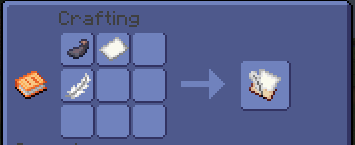
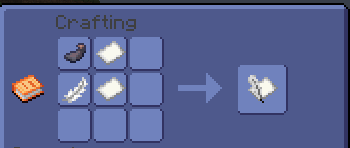
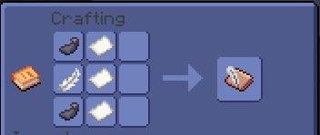
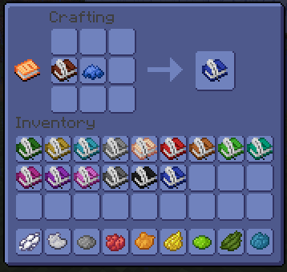

# 📘 Les livres

En complément de l'habituel livre et sa plume, il vous serra possible sur le serveur de crafter différentes variantes de ces livres. Vous pourrez retrouver **le journal**, **la lettre**, **le contrat** et un exemplaire de chaque **livres en couleur**. &#x20;

## **Utilisation**

Que ce soit le journal, la lettre, le contrat ou les livres colorés, son utilisation est simple et est identique au livre à plume de minecraft. Il vous suffit d'effectuer un **clic-droit avec l'item en main** et d'y écrire ce que bon vous semble et selon votre imagination. \
\
Vous retrouverez sur ces items **la possibilité de les signer** afin de les authentifier.

## Craft

### Journal

<figure><figcaption></figcaption></figure>

### Contrat

<figure><figcaption></figcaption></figure>

### Lettre

<figure><figcaption></figcaption></figure>

### Livres colorés

<figure><figcaption></figcaption></figure>
