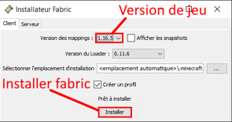

# 🎙 Voice chat

## Installation

### 1. Installer Fabric


Si vous avez déjà installer Fabric, passez à l'étape [#2.-installer-simple-voice-chat](voice-chat.md#2.-installer-simple-voice-chat "mention")


Vous devez d'abord installer Fabric sur votre ordinateur pour pouvoir installer Simple Voice Chat.&#x20;

Téléchargez Fabric ici en cliquant sur le gros bouton bleu "Download Installer" : [https://fabricmc.net/use/installer/](https://fabricmc.net/use/installer/)

À la fin du téléchargement ouvrez le fichier jar  et choisissez la version sur laquelle vous voulez jouer. Puis cliquez sur `Installer`.

<figure><figcaption>
Installateur Fabric
</figcaption></figure>

Maintenant allez dans votre launcher et chercher la version dans votre liste de vos configurations. Si la configuration en question n'y est pas alors créez une nouvelle configuration et cherchez dans le menu déroulant des versions la version de Fabric que vous avez installé.

<figure><figcaption>
Lancer Fabric sur le launcher Minecraft
</figcaption></figure>

### 2. Installer Simple Voice Chat

Téléchargez le mod Simple Voice Chat ici : [https://modrinth.com/plugin/simple-voice-chat/versions](https://modrinth.com/plugin/simple-voice-chat/versions).

Et le deuxième mod requis, Fabric API : [https://modrinth.com/mod/fabric-api/versions](https://modrinth.com/mod/fabric-api/versions).

Quand vous aurez téléchargé les deux mods, vous pourrez les mettre dans votre dossier mods, selon les systèmes il est localisé :

* sur **Windows**, faites le raccourci `windows+R` et tapez `%Appdata%/.minecraft/mods`.
* sur **MacOS**, allez sur le Finder et faites le raccourci `cmd+shift+G` et tapez `~/Library/Application Support/minecraft/mods`.

Quand vous êtes dans le bon dossier, déposez les 2 fichiers téléchargés.

Finalement, lancez le jeu avec la configuration de Fabric que vous avez installé et vous êtes prêt à papoter !

## Utilisation

Simple Voice Chat, comme son nom l'indique, est un mod intuitif à l'utilisation. Nous verrons dans cette section comment configurer le mod ainsi que le fonctionnement du système de groupes.

### Configuration

Les raccourcis de ce mod sont configurables dans les contrôles du jeu, dans la section nommée "Voice Chat". Vous pouvez configurer vos réglages audio en appuyant sur la touche Voice Chat GUI (par défaut `V`).

Dans le menu principal vous pouvez vous **mute**, **désactiver** le tchat vocal, **enregistrer** votre conversation et puis **cacher** les icônes.

Vous pouvez aussi régler vos paramètres audio en cliquant sur "Settings" :

<figure><figcaption></figcaption></figure>

### Système de groupe

Les groupes vous permettent de parler à vos amis où que vous soyez.

**Création de groupe**

Pour en créer un, aller dans le Voice Chat GUI (par défaut la touche `V`) puis cliquez sur "Groupe".

Dans le menu des groupes, vous pouvez nommez votre groupe en cliquant sur la zone de saisie et cliquez sur `+`. Cela va créer un groupe que vos amis pourront rejoindre.

<figure><figcaption></figcaption></figure>

**Rejoindre un groupe**

Dans le menu des groupes, vous pouvez rejoindre un groupe simplement en cliquant sur les groupes listés dans le menu.

<figure><figcaption></figcaption></figure>
